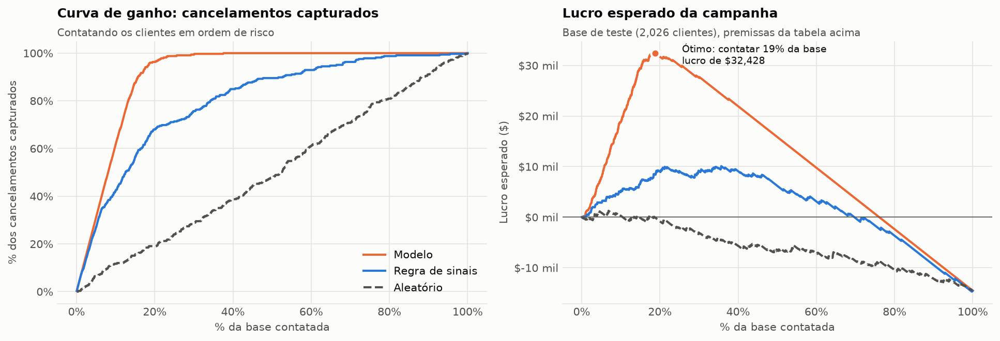
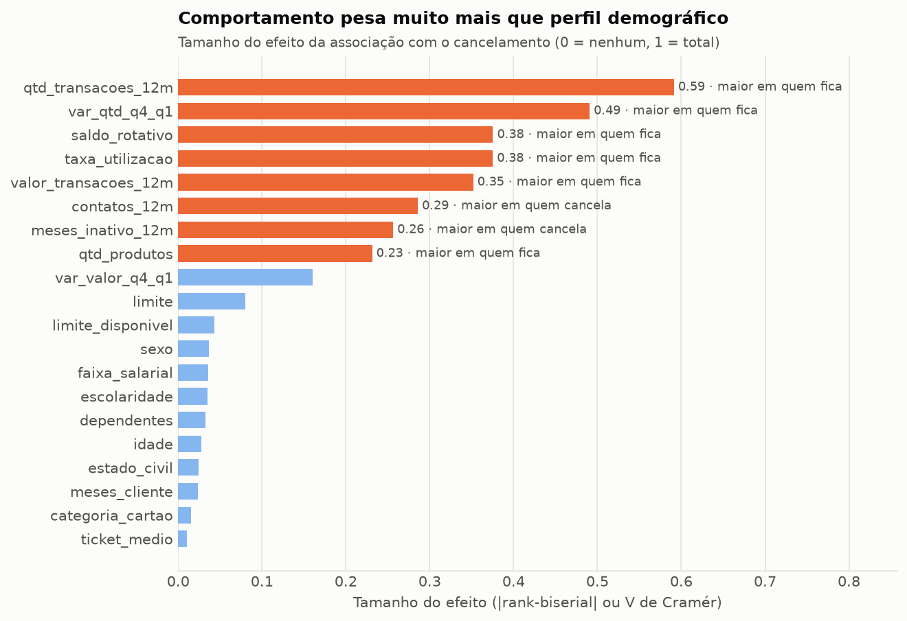
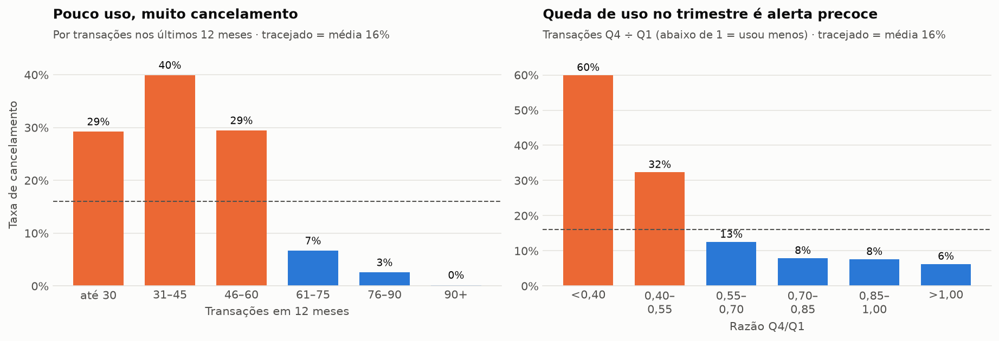
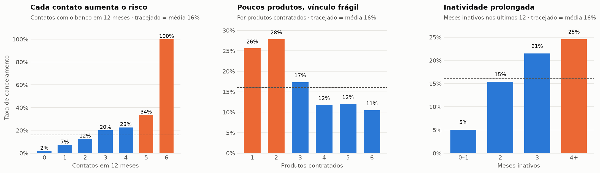
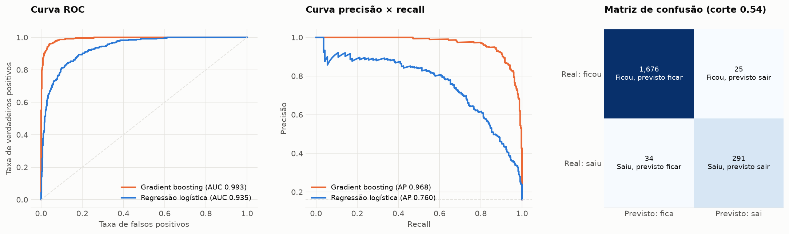

# Previsão de cancelamento de cartões de crédito

**Quem vai cancelar, por quê, e quanto vale agir antes que isso aconteça.**

Análise de 10.127 clientes de uma emissora de cartões: diagnóstico estatístico, modelo preditivo, simulação financeira da campanha de retenção e uma fila de clientes pronta para a equipe agir.

[](https://github.com/RodrigoAp727/previsao-cancelamento-cartoes/actions/workflows/ci.yml) [](https://colab.research.google.com/github/RodrigoAp727/previsao-cancelamento-cartoes/blob/main/notebooks/analise_cancelamento_cartoes.ipynb)   

---

## Resultados em 30 segundos

| | |
|---|---|
| **Taxa de cancelamento** | 16,1% (1.627 de 10.127 clientes) |
| **Desempenho do modelo** (dados nunca vistos) | ROC-AUC **0,993** · identifica **89%** dos cancelamentos com **92%** de precisão |
| **Eficiência** | Contatando **19%** da base, alcança **96%** dos cancelamentos |
| **Impacto estimado** | Lucro **3,2 vezes maior** que o de uma regra de negócio simples; contatar todos daria prejuízo |
| **Entregável operacional** | Fila com **261 clientes ativos em risco**, pronta para a equipe de retenção |



## O problema

A diretoria percebeu que os cancelamentos de cartão estão aumentando. Três perguntas guiaram o estudo:

1. **Quem cancela?** Que comportamentos separam quem sai de quem fica?
2. **Dá para prever?** É possível identificar o cliente em risco a tempo de agir?
3. **Vale a pena agir?** Quantos clientes contatar para ter o maior retorno?

## Principais descobertas

**1. Comportamento prevê o cancelamento; perfil demográfico, não.** A força de cada variável foi medida com testes estatísticos (Mann-Whitney e qui-quadrado) e tamanho de efeito. Uso do cartão domina; sexo, renda e escolaridade têm efeito próximo de zero.



**2. O cliente para de usar o cartão antes de cancelar.** Até 60 transações por ano, 29% a 40% cancelam; acima disso, 7% ou menos. Uma queda forte de uso entre trimestres leva a **60%** de cancelamento: é um alerta precoce.



**3. Atrito no atendimento e vínculo fraco.** A taxa sobe de 2% (nenhum contato com o banco) para 100% (6 contatos). Clientes com 1 ou 2 produtos cancelam mais que o dobro dos que têm 4 ou mais.



**4. Uma regra simples já funciona; o modelo funciona muito melhor.** Cinco sinais de risco, fáceis de calcular em SQL, concentram 71% dos cancelamentos em 20% da base. O modelo de gradient boosting leva isso a 96% dos cancelamentos em 19% da base.



## Recomendações

| Ação | Evidência |
|---|---|
| **Fila mensal de retenção** com os clientes de maior risco, segundo o modelo | 96% dos cancelamentos estão nos 2 primeiros decis de risco |
| **Alerta automático de queda de uso**, com oferta de cashback ou pontos | 60% de cancelamento quando o uso cai mais de 60% entre trimestres |
| **Escalonar o atendimento no 3º contato** em 12 meses | Risco passa de 20% no 3º contato e chega a 100% no 6º |
| **Cross-sell como estratégia de retenção** | 26% a 28% de cancelamento com 1 ou 2 produtos, contra 11% com 4 ou mais |
| **Validar com teste A/B** antes de escalar | Substituir as premissas financeiras por resultados medidos |

## Do estudo à operação: a fila de retenção

Uma análise só gera valor quando alguém age com base nela. O script `src/pontuar.py` transforma o modelo em uma lista de trabalho:

```bash
python -m src.pontuar                    # clientes ativos com risco de pelo menos 15%
python -m src.pontuar --prob-minima 0.4  # só risco Alto e Crítico
```

Ele gera [`reports/fila_retencao.csv`](reports/fila_retencao.csv), com uma linha por cliente ativo em risco:

| id_cliente | prob_cancelamento | faixa_risco | sinais_de_risco | receita_anual_estimada |
|---|---|---|---|---|
| 719621958 | 0,9999 | Crítico | Poucas transações; Queda de uso no trimestre; 3+ contatos; Rotativo zerado | $34,40 |
| ... | | | | |

**Resultado:** 261 dos 8.500 clientes ativos (3%) estão em risco (96 críticos, 64 altos, 101 moderados), com **$57,5 mil de receita anual estimada** em jogo. As probabilidades são calculadas fora da amostra, e a coluna de sinais explica ao atendente *por que* aquele cliente está na lista.

## Diferenciais técnicos

- **Qualidade de dados:** detectei que **9% dos registros** de duas variáveis haviam perdido o separador decimal (`1,335` gravado como `1335`), o que inflava a média em mais de 100 vezes. Depois da correção, os valores máximos batem exatamente com os da fonte original.
- **Validações automáticas** (`src/dados.py`): unicidade de IDs, faixas válidas e a identidade contábil `limite = saldo rotativo + limite disponível`, checada linha a linha.
- **Avaliação sem vazamento:** a base de teste fica separada até o final; os modelos são comparados por validação cruzada estratificada, e o ponto de corte é escolhido com predições *out-of-fold* do treino.
- **Métricas adequadas a classes desbalanceadas:** PR-AUC, recall e precisão, não acurácia.
- **Baseline:** a regressão logística serve de referência para justificar o modelo mais complexo.
- **Do modelo ao dinheiro:** curva de ganho, tabela de lift por decil e simulação de lucro da campanha, com premissas explícitas e parametrizáveis (`PremissasCampanha`).
- **Código modular e reprodutível:** a lógica fica em `src/` e o notebook conta a história; sementes fixas garantem o mesmo resultado a cada execução.
- **Testes automatizados e CI:** 15 testes com `pytest` (limpeza, validações, cálculo financeiro, regra de sinais e desempenho mínimo do modelo). A cada *push*, o GitHub Actions roda os testes, executa o notebook inteiro e gera a fila.

## Estrutura

```text
├── data/
│   ├── raw/ClientesBanco.csv          # base original
│   └── processed/                     # base tratada (gerada pelo notebook)
├── notebooks/
│   └── analise_cancelamento_cartoes.ipynb   # análise completa, com narrativa
├── reports/
│   ├── figures/                       # gráficos exportados
│   └── fila_retencao.csv              # clientes ativos em risco, prontos para contato
├── src/
│   ├── dados.py                       # carga, limpeza e validação
│   ├── graficos.py                    # identidade visual dos gráficos
│   ├── modelagem.py                   # modelos, regra de sinais, decis e simulação de campanha
│   └── pontuar.py                     # gera a fila de retenção e salva o modelo
├── tests/                             # testes automatizados (pytest)
├── .github/workflows/ci.yml           # integração contínua
└── requirements.txt
```

## Como executar

**Sem instalar nada:** clique em [Abrir no Colab](https://colab.research.google.com/github/RodrigoAp727/previsao-cancelamento-cartoes/blob/main/notebooks/analise_cancelamento_cartoes.ipynb) e execute todas as células. O notebook baixa os dados sozinho.

**Localmente:**

```bash
git clone https://github.com/RodrigoAp727/previsao-cancelamento-cartoes.git
cd previsao-cancelamento-cartoes
python -m venv .venv
.venv\Scripts\activate          # Windows  (Linux/Mac: source .venv/bin/activate)
pip install -r requirements.txt

jupyter notebook notebooks/analise_cancelamento_cartoes.ipynb   # análise
python -m src.pontuar                                           # fila de retenção
pytest                                                          # testes
```

## Limitações e próximos passos

- A base é uma **fotografia**, sem datas. Em produção, as variáveis devem ser medidas antes de uma data de corte, prevendo os cancelamentos dos meses seguintes.
- A receita por cliente é **estimada** a partir do uso. O próximo passo é usar a margem real e medir a taxa de sucesso com teste A/B.
- **Modelo de uplift:** priorizar quem *responde* à ação, não apenas quem vai sair.
- **Monitoramento** mensal de drift e de calibração das probabilidades.

## Dados

[Credit Card Customers, Kaggle](https://www.kaggle.com/sakshigoyal7/credit-card-customers), versão com colunas traduzidas para o português.

---

**Rodrigo Aparecido Campos de Oliveira** · Analista de Dados
[LinkedIn](https://www.linkedin.com/in/rodrigo-aparecido-397a0b154) · [GitHub](https://github.com/RodrigoAp727) · [E-mail](mailto:rodrigoapcampos92@gmail.com)
